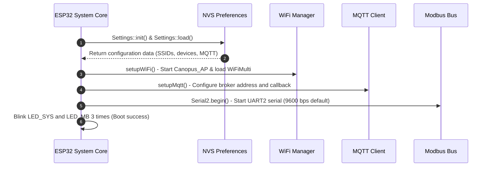
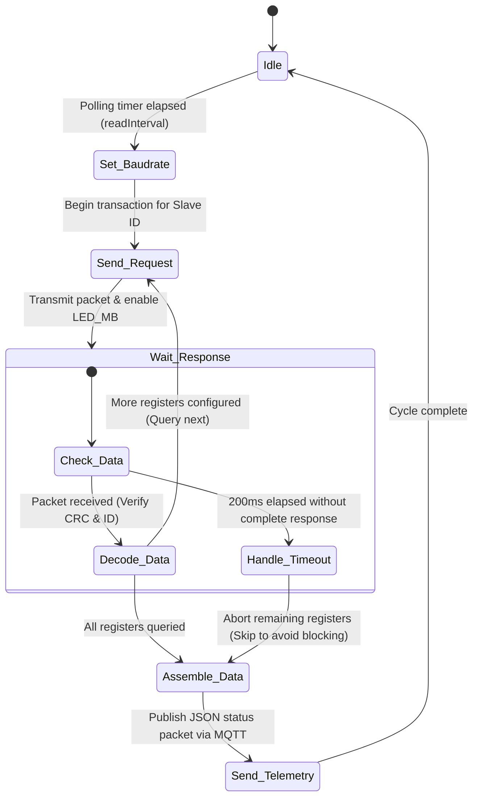

# System Design Document (SDD) - ESP32 Canopus Modbus Gateway

This document provides a detailed specification of the hardware interfaces, software architecture, data flows, and state machines for the **ESP32 Canopus Modbus Gateway**.

---

## 1. System Architecture

The gateway serves as a bi-directional bridge translating industrial **Modbus RTU (RS485)** communication to modern Internet-of-Things (IoT) protocols (**MQTT** and **HTTP REST APIs**) using **WiFi** connectivity.

```mermaid
graph TD
    subgraph Users & Network (Lớp Người Dùng & Mạng)
        Client[Web Browser / Mobile Client]
        Broker[MQTT Broker]
    end

    subgraph ESP32 Canopus Gateway (Lớp Cổng Điều Khiển)
        WebUI[Web Server - Port 80]
        MQTT[MQTT Client]
        CLI[Serial CLI Parser]
        NVS[Preferences - NVS Flash Memory]
        Core[Main Core - Control Loop]
    end

    subgraph Modbus Physical Bus (Lớp Vật Lý Modbus)
        RS485[SP485EE Transceiver]
        Dev1[Modbus Slave 1]
        Dev2[Modbus Slave 2]
        DevN[Modbus Slave N]
    end

    Client <-->|HTTP REST / WebUI| WebUI
    Broker <-->|MQTT Publish/Subscribe| MQTT
    CLI <-->|USB Virtual COM Port| Core
    Core <--> NVS
    WebUI <--> Core
    MQTT <--> Core
    Core <-->|Serial2 UART| RS485
    RS485 <-->|Half-Duplex RS485 Bus| Dev1
    RS485 <-->|Half-Duplex RS485 Bus| Dev2
    RS485 <-->|Half-Duplex RS485 Bus| DevN
```

### Core Components:
1.  **WiFi Manager (AP + STA Mode)**: Runs concurrently in dual modes:
    *   **Access Point (AP)**: Hosts a local open network named `Canopus_AP` at IP `192.168.4.1` for local setup.
    *   **Station (STA)**: Connects to the local router/enterprise WiFi networks (supporting up to 3 configurations with auto-switching).
2.  **Web Server (Port 80)**: Serves the responsive multilingual WebUI Single-Page App (English, Vietnamese, Spanish, Portuguese) stored in flash memory (`PROGMEM`) and exposes REST endpoints for data telemetry and settings.
3.  **MQTT Client (PubSubClient)**: Maintains connection to the designated broker, publishes polled register datasets in JSON, and subscribes to command topics to receive and execute remote Modbus write operations.
4.  **Modbus Master Engine**: Coordinates UART2 serial communication with the onboard SP485EE transceiver to poll configured slave devices.
5.  **Serial CLI Parser**: A serial console parsing CLI commands directly over USB Type-C (Virtual COM Port) at 115200 baud.

---

## 2. Sequence Diagrams & Data Flows

### 2.1 Boot-up & Initialization
Upon power-on, the device initializes peripherals and loads configurations from non-volatile storage:



### 2.2 Execution Loop (Non-Blocking Polling)
The main `loop()` maintains connections, processes clients, and queries Modbus registers using a non-blocking scheduler:

```mermaid
sequenceDiagram
    autonumber
    participant Loop as loop() Thread
    participant MB as ModbusMaster Library
    participant Dev as Modbus Slave Device
    participant MQ as MQTT Client
    participant Web as WebServer

    loop Every Loop Cycle
        Loop->>Web: server.handleClient() - Process WebUI HTTP requests
        alt WiFi Connected & MQTT Enabled
            Loop->>MQ: mqttClient.loop() - Maintain Broker Keep-Alive
        end
        
        alt Polling Interval Elapsed for Device i
            Loop->>Loop: Adjust UART2 baudrate to match device i configuration
            Loop->>MB: node.begin(slaveId, Serial2)
            
            loop Query Each Configured Register j
                Loop->>MB: readHoldingRegisters() / readInputRegisters()
                MB->>Dev: Transmit Request frame (HEX) over RS485
                alt Slave Responds
                    Dev-->>MB: Return Response frame with data bytes
                    MB-->>Loop: ku8MBSuccess (Decode, apply multiplier, save value)
                else Timeout (No Response)
                    Dev--xMB: No response within 200ms
                    MB-->>Loop: ku8MBResponseTimedOut (Abort remaining registers for this device)
                end
            end
            
            alt Device Polled
                Loop->>MQ: publishDeviceData() - Publish JSON payload to broker
            end
        end
    end
```

---

## 3. State Machines

### 3.1 Connection State Machine
The connection manager monitors both WiFi and MQTT states to execute auto-recovery loops:

```mermaid
stateDiagram-v2
    [*] --> Init
    Init --> AP_Active : local AP 'Canopus_AP' started
    
    state AP_Active {
        [*] --> AP_Ready : No WiFi networks stored
        AP_Ready --> AP_Only : Standalone offline configuration
        
        AP_Active --> STA_Connecting : Stored WiFi configs found (wifiCount > 0)
    }

    state STA_Connecting {
        [*] --> Scanning
        Scanning --> Connecting : SSID match found
        Connecting --> STA_Connected : Connection successful (IP assigned)
        Connecting --> Scanning : Failed (Retry after 5s)
    }

    STA_Connected --> MQTT_Connecting : MQTT config valid
    STA_Connected --> STA_No_MQTT : MQTT server blank
    
    state MQTT_Connecting {
        [*] --> ConnectingToBroker
        ConnectingToBroker --> MQTT_Connected : Auth Success & Subscribe to cmd topic
        ConnectingToBroker --> ConnectingToBroker : Fail / Disconnected (Retry after 5s)
    }

    MQTT_Connected --> STA_Connecting : WiFi RSSI Lost / Disconnection
```

### 3.2 Modbus Master Polling Loop State Machine
To prevent bus blocking and gateway lags, individual devices are polled dynamically:


